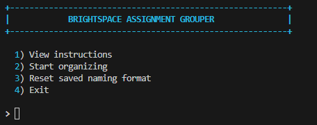

# Brightspace Assignment Grouper

Part of my Brightspace tooling showcase, live at **<https://john-morrissey-ul.github.io>**.



A small interactive tool that unzips bulk Brightspace/D2L submission
downloads and organizes them by student (or group), with one subfolder
per assignment inside each student's folder:

```
Student 22/
  Essay 1/
  Essay 2/
Student 5/
  Essay 1/
```

## Requirements

- **Windows 10 or 11**
- **Python 3** (any recent 3.x version)

No extra packages need to be installed — the tool only uses Python's
standard library. The optional "browse for a folder" button needs
`tkinter`, which is included automatically with the installs below.

## Installing Python from the Microsoft Store

1. Open the **Microsoft Store** app (search for it in the Start menu).
2. Search for **"Python 3"** (e.g. "Python 3.12").
3. Click **Get** / **Install** and wait for it to finish.
4. Open a new **PowerShell** or **Terminal** window and check it worked:
   ```
   python --version
   ```
   If that prints something like `Python 3.12.4`, you're set.

   If Windows says `python` isn't recognized, close and reopen your
   terminal (the Store install updates your PATH, which existing
   terminal windows won't see until restarted).

## Running the tool

1. Download/save `Brightspace assignment grouper.py` somewhere on your
   computer (it doesn't need to be next to your zip files — you'll
   pick a folder from inside the tool).
2. Open PowerShell or Terminal, navigate to the folder containing the
   script, and run:
   ```
   python "Brightspace assignment grouper.py"
   ```
   Or double-click the file if `.py` files are associated with Python
   on your system.
3. Follow the on-screen menu.

## How it works

1. **Choose organizing** from the main menu, then pick (or browse to)
   the folder containing your zip files.
2. **Confirm** the list of zip files found looks right.
3. **Naming format detection** — the first time you run the tool (or
   after choosing "Reset saved naming format"), it opens one real
   submission folder name from your zips and splits it into every
   individual word and number, e.g.:
   ```
   36275-10937 - 0010087 Student 22 - 07 December 2023 0931
   ```
   splits into:
   ```
   1) 36275   2) 10937   3) 0010087   4) Student   5) 22
   6) 07      7) December  8) 2023     9) 0931
   ```
   You're asked which part number(s) are the **student name / group
   name** — the value everything gets grouped and named by. Combine
   more than one part by separating the numbers with a space, dash,
   or underscore (e.g. `4-5` for "Student 22"). A sensible default is
   pre-filled — press Enter to accept it, or type your own.

   This step exists because Brightspace admins can customize how
   submission folders are named per institution, so there's no single
   fixed pattern that works everywhere.
4. **Preview** — before anything happens, you're shown exactly which
   folders would be created and how many submissions land in each, so
   you can catch a bad pick before committing.
5. **Organizing** — the tool extracts each zip, groups the submission
   folders by the student/group name you identified, and moves them
   into `<student or group name>/<assignment name>/` folders next to
   your zip files. The **assignment name** is taken from each zip
   file's own name (e.g. `Essay 1.zip` → an `Essay 1` subfolder), so
   rename your zips beforehand if you want more readable assignment
   names in the result. The temporary extraction folder is cleaned up
   automatically afterward.

Your naming-format answer is remembered (stored in your Windows user
profile) so you won't be asked again on future runs, unless you choose
**"Reset saved naming format"** from the main menu — useful if you
switch to a course/institution with a differently-formatted export.

## Troubleshooting

**Getting a "path too long" or other file/folder error when opening
files afterward?**

Windows has a 260-character limit on full file paths by default. This
tool nests folders fairly deeply
(`<your folder>/<student>/<assignment>/<original submission folder name>/...`),
and Brightspace's original submission folder names are already long, so
the combined path can go over that limit for deeply-buried files —
Explorer (or other apps) may then fail to open, copy, or delete them
even though the tool itself reported success.

If that happens:
- Open/extract things with **[7-Zip](https://www.7-zip.org/)** instead
  of Windows Explorer — it handles long paths far more reliably.
- Or move your zip files (and this tool) to a short path near the
  drive root, e.g. `C:\Grouped\`, before running the tool, to leave
  more room under the limit.
- Or enable long path support: Settings → search **"Enable Win32 long
  paths"** → turn it on (Windows 10 1607+, requires admin rights).

## Navigation

- Type `b` at most prompts to go back a step.
- Type `q` at any prompt to quit.
